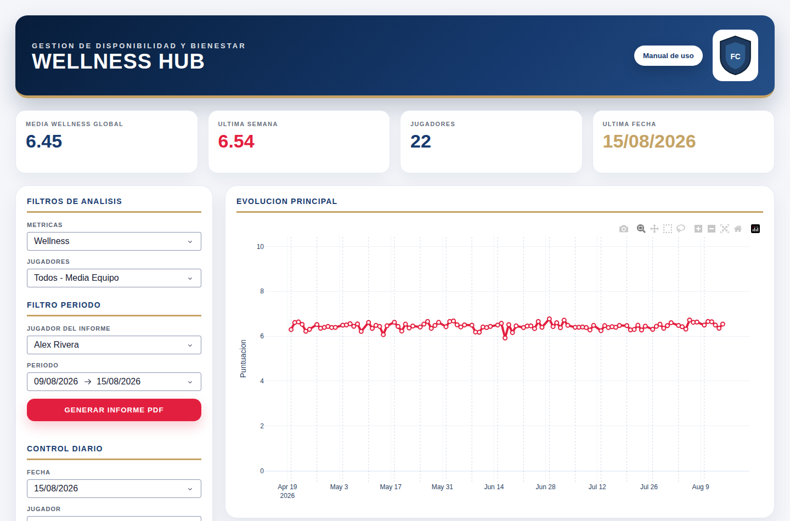

# Wellness Dashboard

Internal dashboard for monitoring the daily physical and mental readiness of a
professional football squad. Players fill in a short questionnaire before and
after training; the dashboard turns those answers into a single wellness score,
tracks it per player and across the squad, flags the players who need attention,
and exports a per-player PDF report for the coaching staff.

Built during my time in the analytics department of a professional football club.



## No real data is published here

The dashboard was built against a club's internal wellness export: named players
and their daily answers on sleep, fatigue, muscle pain and stress. That is
personal health data and it is **not** in this repository — not in the files, not
in the history.

What is here instead is `scripts/generate_sample_data.py`, which produces an
Excel file with the exact same columns and shape, filled with invented players
and randomly generated answers. Every screenshot in this README was taken
against that synthetic file. The app is unchanged: point it at a real export and
it behaves the same way.

## What it does

**Data preparation** — reads the raw questionnaire export, normalises the Spanish
column names, and rescales every metric to a common 0–10 axis. Metrics where a
high answer is bad (fatigue, muscle pain, stress) are inverted so that on every
chart, higher always means better.

**Wellness score** — a per-player, per-day composite built from the rescaled
metrics, which is what the staff actually looks at day to day.

**Squad and player views** — squad-wide trend over any period, per-player
history, day-of-week breakdowns, and comparisons of a player against the squad
average.

**Alerts** — the questionnaire has two free-text fields for anything out of the
ordinary. Any day a player writes something there is surfaced as an alert, so a
note does not get lost in a spreadsheet.

**PDF reports** — a formatted per-player report over a chosen date range,
generated on demand from the interface.

## Stack

Python · pandas · NumPy · Plotly · Dash · Matplotlib · fpdf2 · openpyxl

## Running it

```bash
python -m pip install -r requirements.txt
python scripts/generate_sample_data.py
python src/wellness_dashboard.py
```

The app picks a free port and opens a browser automatically. Set `WELLNESS_PORT`
to pin it to a fixed one.

To run it against your own export instead of the synthetic sample, pass the path
as an argument or set an environment variable:

```bash
python src/wellness_dashboard.py "path/to/Wellness Export morning.xlsx"
# or
export WELLNESS_EXCEL_PATH="path/to/Wellness Export morning.xlsx"
```

The file must have the same columns as the ones listed in
`scripts/generate_sample_data.py`.

## Layout

```
src/wellness_dashboard.py      the whole application: load, clean, score, serve
src/assets/                    static files served by Dash
scripts/generate_sample_data.py  synthetic questionnaire export generator
docs/                          screenshots used in this README
```

## Notes

The application is a single module, which is how it grew: it started as an
exploratory notebook and was converted into a runnable app once the staff began
using it daily. It is kept that way here rather than retrofitted, so what you
read is what actually ran.
